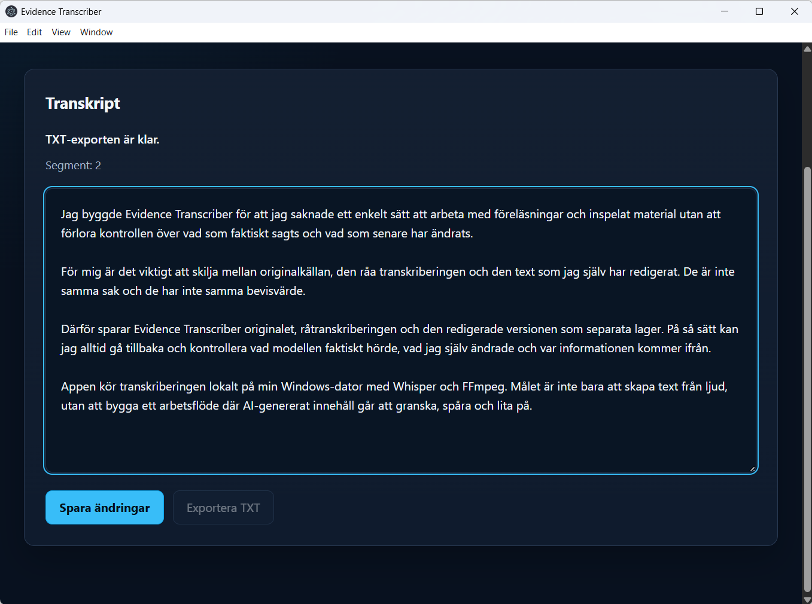
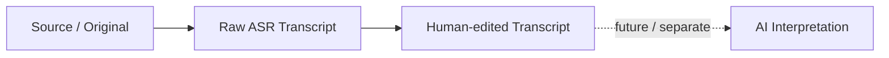
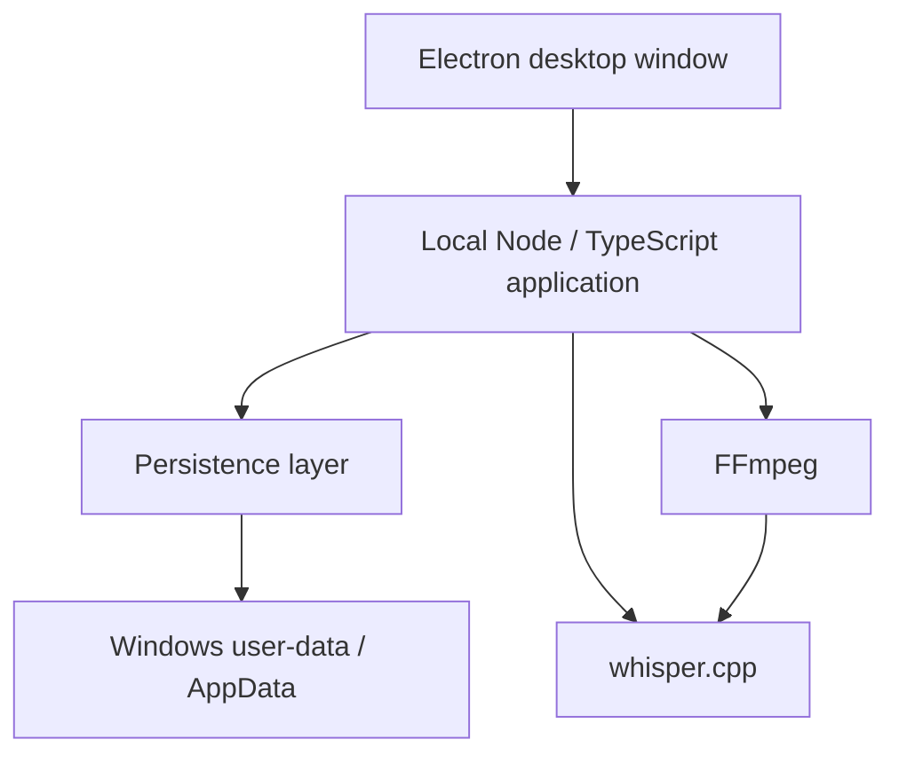

# Evidence Transcriber

Evidence Transcriber is a Windows-first, local-first transcription application built around **evidence provenance**.

It preserves the original source, raw machine transcript and human-edited transcript as separate layers so that later changes and future AI interpretation can be traced back to their source.

The project is also a Quality Engineering portfolio project: important behaviour is treated as something to verify with explicit evidence rather than infer from a successful demo.

## Current desktop application

The current packaged Windows desktop build supports the verified local workflow from source audio or recording through transcription, editing, persistence and TXT export on the current target machine.



---

## Why this project exists

Transcription is easy to demonstrate.

Trusting what happens to the transcript afterwards is harder.

For lectures, meetings and recorded material it is useful to distinguish between:

- what was actually recorded,
- what the speech-to-text model produced,
- what a human later corrected,
- and what a future AI system may infer or interpret.

Evidence Transcriber is designed around preserving that distinction.

The current product does not perform AI summarisation or interpretation.

---

## Core provenance model



These layers have different evidentiary status.

Human editing therefore does not silently replace the raw ASR result.

---

## Current product state

The current verified product baseline is a **packaged Windows desktop application**.

Normal use of that packaged build does not require PowerShell or a development server to be started manually.

The application uses:

- Electron for the Windows desktop shell,
- a local Node/TypeScript application layer,
- FFmpeg for audio preprocessing and capture,
- whisper.cpp with a local Whisper medium model,
- local filesystem persistence under the application's Windows user-data directory.

The packaged baseline is frozen at:

- tag: `packaged-baseline-0.1`
- commit: `f176e78`

---

## Current verified capabilities

### Windows desktop

Verified on the current target Windows machine:

- standalone Electron desktop launch,
- embedded local application/server runtime,
- normal use without terminal interaction,
- close and restart,
- persistent application data under Windows user data / AppData,
- packaged runtime resources.

### File import

The current workflow supports and has been exercised with:

- M4A
- MP3
- WAV
- MP4 containing audio

The imported source is copied into a persistent session before transcription.

### Local transcription

The transcription pipeline is local:

```text
preserved source
      ↓
FFmpeg preprocessing
      ↓
16 kHz mono WAV
      ↓
whisper.cpp
      ↓
Whisper medium
      ↓
raw transcript + segment timestamps
```

Swedish transcription is the current primary language path.

No cloud ASR service is required for the current product workflow.

### Provenance and persistence

Verified behaviour includes:

- preserved source/original,
- immutable raw transcript during normal human editing,
- separate edited transcript,
- explicit edited → raw provenance reference,
- persistent sessions,
- session reopen,
- edited transcript restored after restart,
- session/source consistency checks,
- UTF-8 persistence.

The persisted structure is conceptually:

```text
session/
├─ session.json
├─ source/
│  └─ original media
├─ raw-transcript.json
├─ edited-transcript.json
└─ work/
   ├─ preprocessed.wav
   └─ whisper output
```

### Export

Verified desktop export includes:

- TXT export,
- UTF-8 text,
- native Windows `Save As` dialog,
- selectable filename,
- selectable destination.

The edited transcript is exported when one exists; otherwise the raw transcript is used.

---

## Recording

Recording is integrated into the desktop product, not only a feasibility experiment.

The current verified target-machine workflow supports:

```text
Windows system audio
        +
microphone
        ↓
FFmpeg capture/mix
        ↓
recording.wav
        ↓
persistent recording metadata
        ↓
optional local transcription
```

Current capabilities include:

- record,
- stop,
- persistent recorded source,
- reopenable recording metadata,
- direct transcription after recording,
- recordings that can remain stored without immediate transcription,
- linkage from a recording to its later transcription session.

### Important recording limitation

The current capture implementation uses device names from the present target machine:

```text
Stereo Mix (Realtek(R) Audio)
Microphone Array (Realtek(R) Audio)
```

Generic Windows audio-device discovery and selection have **not** yet been qualified.

Recording should therefore currently be understood as verified on the present target hardware, not as generally verified across arbitrary Windows computers.

One incomplete local recording directory has also been observed where the recorded WAV exists but recording metadata is absent. Automatic cleanup/recovery for this situation has not yet been qualified.

---

## Architecture



The Electron process configures packaged runtime paths and application storage before starting the local application layer.

In packaged mode the runtime currently includes:

- `ffmpeg.exe`
- `whisper-cli.exe`
- `ggml-medium.bin`

---

## Local AI runtime

The speech-to-text model runs locally through whisper.cpp.

Current packaged runtime characteristics on the qualification machine are approximately:

- Whisper medium model: **1.46 GB**
- complete unpacked packaged application: **2.03 GB**

Local-first processing provides an offline/private processing option because recordings do not need to be sent to a cloud ASR service.

It also has trade-offs:

- large packaged runtime,
- CPU processing time,
- hardware-dependent performance,
- local model accuracy limitations.

Local-first does not imply that local ASR is automatically faster or more accurate than cloud alternatives.

---

## Quality Engineering approach

Evidence Transcriber is deliberately developed as a Quality Engineering project rather than only as a feature prototype.

Current engineering practices include:

- risk-based verification,
- source preservation checks,
- raw/edited provenance checks,
- persistence and reopen verification,
- failure/recovery investigation,
- TypeScript type checking,
- repeatable regression tests,
- packaged-runtime qualification,
- SHA-256 evidence for critical provenance claims,
- frozen known-good product baselines,
- explicit `PASS`, `FAIL` and `NOT VERIFIED` distinctions.

Current product regression:

```bash
npm run typecheck
npm run build
npm test
```

At the 2026-08-24 Current Product State Checkpoint all three passed.

The automated product regression currently focuses primarily on persistence/provenance. It is not a complete automated test suite for every desktop workflow.

---

## AI-Native Qualification experiment

A separate experiment was built around the packaged product baseline.

Its question was deliberately bounded:

> Can an AI agent autonomously plan, execute and adapt a meaningful software qualification workflow while deterministic evidence remains the authority for critical PASS/FAIL conclusions?

The qualification architecture separates:

```text
AI reasoning
      ↓
Decision Gateway
      ↓
controlled atomic test actions
      ↓
real packaged application
      ↓
observations
      ↓
deterministic oracles
      ↓
qualification result
```

The AI decision layer was allowed to:

- select from predefined atomic qualification actions,
- reason about current risk,
- consume observations,
- consume deterministic oracle results,
- adapt the next selected action.

It was not allowed to modify product source code or bypass the controlled executor.

### Final Eval 0 result

The final autonomous run produced deterministic PASS evidence for:

- source/original preservation,
- raw transcript immutability,
- edited transcript separation,
- restart/reopen persistence.

The final run used:

- product: `packaged-baseline-0.1`
- qualification harness: `autonomous-qualification-0.2`
- human interventions during the autonomous loop: **0**

Eval 0 is closed at:

- tag: `ai-native-qualification-eval-0`
- closure commit: `cbe6cc5`

Detailed evidence is documented under `docs/`.

### Important false-confidence finding

An earlier autonomous run exposed a useful failure mode.

The AI's stop reasoning implied that source/original preservation had been verified even though only raw-transcript preservation had deterministic evidence.

The deterministic qualification layer refused to convert that statement into PASS and correctly reported the unsupported claim as:

`NOT VERIFIED`

The decision contract was then tightened and a dedicated source/original oracle was added.

This produced a central architectural lesson:

> **AI reasoning and deterministic qualification authority should be separated.**

Eval 0 demonstrates a bounded autonomous qualification workflow.

It does **not** demonstrate general autonomous testing ability or replacement of professional software testers.

---

## Verified

Current evidence supports the following:

- packaged Windows desktop application on the target machine,
- local FFmpeg preprocessing,
- local whisper.cpp transcription,
- Swedish ASR workflow,
- M4A / MP3 / WAV / MP4 audio import,
- source/original preservation,
- raw transcript persistence and immutability during editing,
- separate human-edited transcript,
- persistence and reopen,
- TXT export through native Save As,
- system-audio + microphone recording on the current target machine,
- recording persistence,
- packaged FFmpeg / whisper.cpp / Whisper medium runtime,
- provenance-focused automated regression,
- bounded AI-native qualification Eval 0.

---

## Not yet verified / known limitations

The following should not be inferred from the current project:

- installer-based distribution,
- clean-machine installation,
- Start menu / desktop shortcut installation,
- uninstall workflow,
- application update mechanism,
- generic Windows recording-device discovery,
- recorder portability across arbitrary Windows hardware,
- microphone-only or system-audio-only selectable capture modes,
- complete recovery/cleanup of interrupted recording artefacts,
- broad classroom field validation,
- broad usability study,
- accessibility qualification,
- security qualification,
- statistical ASR benchmarking,
- speaker diarisation,
- real-time transcription,
- cloud transcription,
- AI summarisation,
- RAG,
- AI interpretation in the product,
- general autonomous software testing competence.

The current unpacked packaged build is also large because the local Whisper medium model is bundled.

---

## Product vs qualification experiment

The product and the AI-native qualification experiment are separate concerns.

### Product runtime AI

Evidence Transcriber currently uses:

- local whisper.cpp,
- local Whisper medium,
- for speech-to-text.

### Qualification experiment AI

The Eval 0 harness used an external AI model only as a **test-decision layer**.

That model is not required for normal Evidence Transcriber transcription.

Critical qualification conclusions were produced by deterministic oracles, not by the model's opinion.

---

## Current phase

The product has moved beyond the original browser-based Student Alpha.

Current state:

> **Packaged Windows baseline qualified on the target machine; distribution and real classroom field validation are not yet qualified.**

The Current Product State Checkpoint intentionally freezes feature development while repository state, external documentation and the next single product investment are reviewed.

---

## High-level roadmap

Near-term work should remain evidence-driven.

Current unresolved product areas include:

1. usable distribution beyond the development machine,
2. recording portability beyond the current hard-coded audio devices,
3. classroom / study-use field validation,
4. comparative ASR/value evaluation where justified.

The exact next product slice is intentionally decided by the project steering checkpoint rather than opened automatically.

Future ideas such as diarisation, RAG, AI interpretation, cloud sync and broader AI features remain outside the current verified product scope.

---

## Repository and distribution notes

Large runtime artefacts are intentionally excluded from normal Git history, including:

- Whisper model files,
- FFmpeg binaries,
- downloaded/build whisper.cpp binaries,
- packaged application output,
- local sessions,
- qualification run data.

The current unpacked build is produced locally using the runtime resources configured in `package.json`.

No installer or release distribution mechanism has yet been qualified.

---

## License status

This repository is public for portfolio, educational review and technical evaluation.

It is **not open source**.

The project is marked `UNLICENSED` in its npm metadata and the repository-level `LICENSE` notice reserves reuse rights.

Public visibility does not grant permission to copy, modify, redistribute, sublicense, publish or otherwise reuse the source code. Third-party dependencies remain subject to their own licenses.
---

## Portfolio context

Evidence Transcriber is being developed as both a useful study tool and a Quality Engineering portfolio project.

The project demonstrates work with:

- TypeScript / Node.js,
- Electron,
- Windows integration,
- local AI inference,
- provenance,
- persistence,
- data integrity,
- risk-based testing,
- failure investigation,
- regression protection,
- deterministic test oracles,
- human review of model output,
- bounded AI-agent qualification experiments.

The emphasis is not simply on adding AI features.

The emphasis is on making AI-generated output **traceable, testable and safe to modify**.