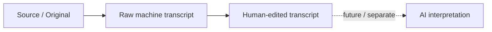
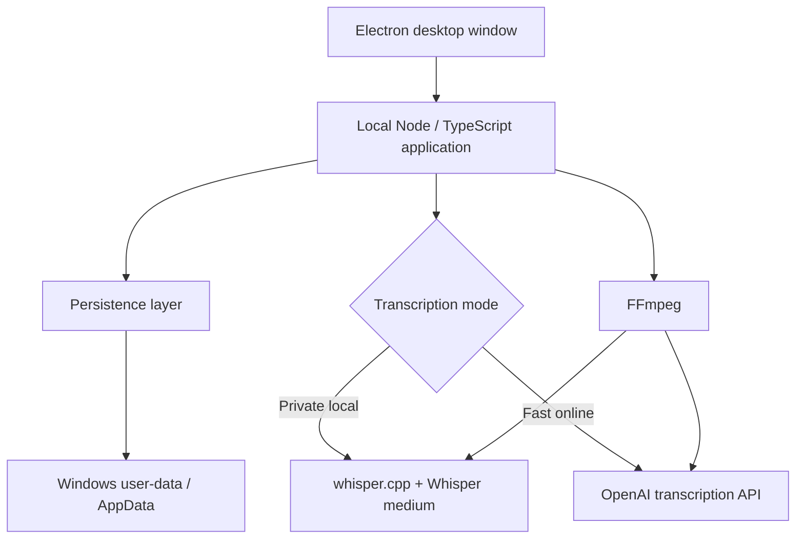

# Evidence Transcriber

Evidence Transcriber is a **Windows-first, evidence-first hybrid transcription application** built around evidence provenance.

It provides two explicit transcription paths:

- **Fast online** — OpenAI `gpt-4o-mini-transcribe`
- **Private local** — `whisper.cpp` + Whisper medium

Both paths preserve the same provenance model:

**source/original → raw machine transcript → human-edited transcript → future AI interpretation**

The goal is not only to produce text quickly. The goal is to preserve what was recorded, what the machine produced, what a human later changed, and what a future AI system may infer or interpret as separate, traceable layers.

The project is also a Quality Engineering portfolio project: important behaviour is treated as something to verify with explicit evidence rather than infer from a successful demo.

## Current desktop application

The current master branch provides a Windows Electron desktop application supporting imported audio/video and recorded Windows system audio + microphone.

Hybrid Transcription 0.1 supports both **Fast online** and **Private local** transcription while preserving source/original, raw transcript, human-edited transcript, persistence, reopen and TXT export in the same provenance-aware workflow.

The hybrid workflow has been manually verified in the development Electron desktop flow.

The previously frozen packaged baseline is local-only. Hybrid Transcription 0.1 has not yet been packaged and re-qualified.


---

## Why this project exists

Transcription is easy to demonstrate.

Trusting what happens to the transcript afterwards is harder.

For lectures, meetings and recorded material it is useful to distinguish between:

- what was actually recorded,
- what the speech-to-text model produced,
- what a human later corrected,
- and what a future AI system may infer or interpret.

Evidence Transcriber is designed around preserving that distinction.

The current product does not perform AI summarisation or interpretation.

---

## Core provenance model



These layers have different evidentiary status.

Human editing therefore does not silently replace the raw ASR result.

---

## Hybrid transcription

Hybrid Transcription 0.1 exposes two explicit operating modes rather than treating local and cloud ASR as interchangeable implementations.

### Fast online

Fast online uses the OpenAI transcription API with:

- provider: OpenAI
- model: `gpt-4o-mini-transcribe`
- current language path: Swedish-first
- raw transcript text persisted separately from later human edits
- no fabricated segment timestamps when the provider response does not supply them

Fast online sends prepared audio chunks to OpenAI for transcription.

It is intended for situations where turnaround time matters.

### Private local

Private local uses:

- FFmpeg preprocessing
- `whisper.cpp`
- Whisper medium
- local CPU inference
- segment timestamps
- no cloud ASR requirement

Private local is intended for situations where local/offline processing matters.

### Measured trade-off

A real 10-minute Swedish classroom specimen was used for a same-source comparison on the current qualification machine.

| Mode | Engine | Time for 10 min audio | Relative speed | Timing metadata |
|---|---|---:|---:|---|
| Fast online | OpenAI `gpt-4o-mini-transcribe` | ~14.5 s | ~41× realtime | No segment timestamps in 0.1 |
| Private local | `whisper.cpp` + Whisper medium | ~432.9 s / 7.21 min | ~1.39× realtime | Segment timestamps |

For this specimen, Fast online was approximately **29.8× faster** than the current local pipeline.

This is a product trade-off, not a replacement decision:

- choose **Fast online** when turnaround time matters
- choose **Private local** when local/offline processing matters

The same provenance model is preserved across both paths.

---

## Current product state

The current master branch contains **Hybrid Transcription 0.1** in the Windows Electron desktop application.

Fast online and Private local have been manually verified in the development Electron desktop flow.

The previously qualified packaged baseline is local-only. Hybrid Transcription 0.1 has not yet been packaged and re-qualified.

Normal use of the previously qualified packaged local baseline does not require a browser or development server to be started manually.

The application uses:

- Electron for the Windows desktop shell
- a local Node/TypeScript application layer
- FFmpeg for audio preprocessing and capture
- `whisper.cpp` with a local Whisper medium model for Private local
- OpenAI `gpt-4o-mini-transcribe` for Fast online
- local filesystem persistence under the application's Windows user-data directory

The earlier packaged local baseline is frozen at:

- tag: `packaged-baseline-0.1`
- commit: `f176e78`

Hybrid Transcription 0.1 was merged to `master` in:

- merge commit: `82f5c21`

---

## Current verified capabilities

### Windows desktop

Verified on the current target Windows machine:

- standalone Electron desktop launch
- embedded local application/server runtime
- normal packaged use without terminal interaction for the local-only packaged baseline
- close and restart
- persistent application data under Windows user data / AppData
- packaged local runtime resources
- hybrid transcription mode selection in the development Electron desktop flow

### File import

The current workflow supports and has been exercised with:

- M4A
- MP3
- WAV
- MP4 containing audio

The imported source is copied into a persistent session before transcription.

### Fast online transcription

The Fast online path uses:

```text
preserved source
      ↓
FFmpeg chunk preparation
      ↓
OpenAI transcription API
      ↓
gpt-4o-mini-transcribe
      ↓
raw transcript text
```

Fast online currently prioritises turnaround speed.

In Hybrid Transcription 0.1 it does not provide segment timestamps, and Evidence Transcriber does not fabricate timing information that the provider did not return.

### Private local transcription

The Private local path uses:

```text
preserved source
      ↓
FFmpeg preprocessing
      ↓
16 kHz mono WAV
      ↓
whisper.cpp
      ↓
Whisper medium
      ↓
raw transcript + segment timestamps
```

Swedish transcription is the current primary language path.

No cloud ASR service is required when Private local is selected.

### Provenance and persistence

Verified behaviour includes:

- preserved source/original
- immutable raw transcript during normal human editing
- separate edited transcript
- explicit edited → raw provenance reference
- persistent sessions
- session reopen
- edited transcript restored after restart
- session/source consistency checks
- UTF-8 persistence
- compatibility with both timestamped Private local raw transcripts and non-timestamped Fast online raw transcripts

The persisted structure is conceptually:

```text
session/
├─ session.json
├─ source/
│  └─ original media
├─ raw-transcript.json
├─ edited-transcript.json
└─ work/
   └─ processing artefacts
```

### Export

Verified desktop export includes:

- TXT export
- UTF-8 text
- native Windows `Save As` dialog
- selectable filename
- selectable destination

The edited transcript is exported when one exists; otherwise the raw transcript is used.

---

## Recording

Recording is integrated into the desktop product, not only a feasibility experiment.

The current verified target-machine workflow supports:

```text
Windows system audio
        +
microphone
        ↓
FFmpeg capture/mix
        ↓
recording.wav
        ↓
persistent recording metadata
        ↓
Fast online or Private local transcription
```

Current capabilities include:

- record
- stop
- persistent recorded source
- reopenable recording metadata
- direct transcription after recording
- recordings that can remain stored without immediate transcription
- linkage from a recording to its later transcription session

### Important recording limitation

The current capture implementation uses device names from the present target machine:

```text
Stereo Mix (Realtek(R) Audio)
Microphone Array (Realtek(R) Audio)
```

Generic Windows audio-device discovery and selection have **not** yet been qualified.

Recording should therefore currently be understood as verified on the present target hardware, not as generally verified across arbitrary Windows computers.

One incomplete local recording directory has also been observed where the recorded WAV exists but recording metadata is absent. Automatic cleanup/recovery for this situation has not yet been qualified.

---

## Architecture



The application layer preserves the source and normalises the resulting raw transcript into a provenance-aware session model without inventing timing evidence that a provider did not return.

The Electron process configures packaged runtime paths and application storage before starting the local application layer.

In the qualified packaged local baseline the runtime includes:

- `ffmpeg.exe`
- `whisper-cli.exe`
- `ggml-medium.bin`

---

## Private local runtime

Private local speech-to-text runs through `whisper.cpp` and Whisper medium.

Current packaged local runtime characteristics on the qualification machine are approximately:

- Whisper medium model: **1.46 GB**
- complete unpacked packaged application: **2.03 GB**

Private local provides an offline/local processing option because recordings do not need to be sent to a cloud ASR service.

It also has trade-offs:

- large packaged runtime
- CPU processing time
- hardware-dependent performance
- local model accuracy limitations

Local processing does not imply that local ASR is automatically faster or more accurate than online alternatives.

---

## Quality Engineering approach

Evidence Transcriber is deliberately developed as a Quality Engineering project rather than only as a feature prototype.

Current engineering practices include:

- risk-based verification
- source preservation checks
- raw/edited provenance checks
- persistence and reopen verification
- failure/recovery investigation
- TypeScript type checking
- repeatable regression tests
- packaged-runtime qualification
- SHA-256 evidence for critical provenance claims
- frozen known-good product baselines
- explicit `PASS`, `FAIL` and `NOT VERIFIED` distinctions
- boundary-condition testing from real desktop use
- field validation under real study conditions

Current product regression includes:

```bash
npm run typecheck
npm run build
npm test
npx tsx src/hybrid-transcription.test.ts
```

The automated product regression focuses primarily on persistence, provenance and hybrid raw-transcript compatibility.

It is not a complete automated test suite for every desktop workflow.

### Boundary defect found by desktop smoke test

The first real Fast online desktop smoke test exposed a boundary condition that the green automated regression had not found.

A **600.06-second** Swedish classroom specimen was split into:

- one normal ~600-second chunk
- one trailing chunk of roughly **0.06 seconds**

The trailing chunk returned no transcript text.

The application initially treated that single empty chunk as a fatal failure even though the main chunk had transcribed successfully.

The behaviour was corrected so that:

- an individual empty or silent chunk may return no text
- the complete assembled transcription is still rejected if the final transcript is empty

The same desktop flow was rerun after the fix and passed through:

- transcription
- human edit
- save
- reopen
- TXT export

This is retained as QA evidence because it demonstrates why green automated tests are not treated as proof that all meaningful product behaviour has been exercised.

---

## AI-Native Qualification experiment

A separate experiment was built around the packaged local product baseline.

Its question was deliberately bounded:

> Can an AI agent autonomously plan, execute and adapt a meaningful software qualification workflow while deterministic evidence remains the authority for critical PASS/FAIL conclusions?

The qualification architecture separates:

```text
AI reasoning
      ↓
Decision Gateway
      ↓
controlled atomic test actions
      ↓
real packaged application
      ↓
observations
      ↓
deterministic oracles
      ↓
qualification result
```

The AI decision layer was allowed to:

- select from predefined atomic qualification actions
- reason about current risk
- consume observations
- consume deterministic oracle results
- adapt the next selected action

It was not allowed to modify product source code or bypass the controlled executor.

### Final Eval 0 result

The final autonomous run produced deterministic PASS evidence for:

- source/original preservation
- raw transcript immutability
- edited transcript separation
- restart/reopen persistence

The final run used:

- product: `packaged-baseline-0.1`
- qualification harness: `autonomous-qualification-0.2`
- human interventions during the autonomous loop: **0**

Eval 0 is closed at:

- tag: `ai-native-qualification-eval-0`
- closure commit: `cbe6cc5`

Detailed evidence is documented under `docs/`.

### Important false-confidence finding

An earlier autonomous run exposed a useful failure mode.

The AI's stop reasoning implied that source/original preservation had been verified even though only raw-transcript preservation had deterministic evidence.

The deterministic qualification layer refused to convert that statement into PASS and correctly reported the unsupported claim as:

`NOT VERIFIED`

The decision contract was then tightened and a dedicated source/original oracle was added.

This produced a central architectural lesson:

> **AI reasoning and deterministic qualification authority should be separated.**

Eval 0 demonstrates a bounded autonomous qualification workflow.

It does **not** demonstrate general autonomous testing ability or replacement of professional software testers.

---

## Verified

Current evidence supports the following:

- packaged local Windows desktop baseline on the target machine
- Fast online transcription with OpenAI `gpt-4o-mini-transcribe` in the development Electron desktop flow
- Private local transcription with `whisper.cpp` + Whisper medium
- hybrid local/cloud mode selection in the development Electron desktop flow
- real Swedish classroom audio smoke testing
- local FFmpeg preprocessing
- Swedish ASR workflow
- M4A / MP3 / WAV / MP4 audio import
- source/original preservation
- raw transcript persistence and immutability during editing
- separate human-edited transcript
- persistence and reopen
- TXT export through native Save As
- segment timestamps in Private local
- explicit absence of fabricated timestamps for Fast online 0.1
- system-audio + microphone recording on the current target machine
- recording persistence
- packaged FFmpeg / `whisper.cpp` / Whisper medium runtime in the local packaged baseline
- provenance-focused automated regression
- hybrid raw-transcript compatibility regression
- bounded AI-native qualification Eval 0

---

## Not yet verified / known limitations

The following should not be inferred from the current project:

- packaged Hybrid Transcription 0.1 build and re-qualification
- installer-based distribution
- clean-machine installation
- Start menu / desktop shortcut installation
- uninstall workflow
- application update mechanism
- generic Windows recording-device discovery
- recorder portability across arbitrary Windows hardware
- microphone-only or system-audio-only selectable capture modes
- complete recovery/cleanup of interrupted recording artefacts
- broad multi-course classroom field validation
- broad usability study
- accessibility qualification
- security qualification
- broad cloud/local accuracy benchmarking
- segment timestamps in Fast online 0.1
- cloud-provider portability
- production-grade API credential management
- production-grade in-product disclosure/consent UX for Fast online cloud processing
- speaker diarisation
- real-time transcription
- AI summarisation
- RAG
- AI interpretation in the product
- general autonomous software testing competence

The qualified unpacked local packaged build is also large because the Whisper medium model is bundled.

---

## Product vs qualification experiment

The product and the AI-native qualification experiment are separate concerns.

### Product runtime AI

Evidence Transcriber currently has two ASR paths in the product runtime.

#### Fast online

- OpenAI transcription API
- `gpt-4o-mini-transcribe`
- rapid online transcription
- no segment timestamps in Hybrid Transcription 0.1

#### Private local

- `whisper.cpp`
- Whisper medium
- local/offline processing
- segment timestamps

These product-runtime models are separate from the external AI model used in the bounded qualification experiment.

### Qualification experiment AI

The Eval 0 harness used an external AI model only as a **test-decision layer**.

That model is not required for normal Evidence Transcriber transcription.

Critical qualification conclusions were produced by deterministic oracles, not by the model's opinion.

---

## Current phase

The product has moved beyond the original browser-based Student Alpha and beyond the local-only packaged baseline.

Current state:

> **Hybrid Transcription 0.1 + active Classroom Field Validation**

Classroom Field Validation is now being carried out during real EC Software Tester teaching rather than only against previously recorded classroom material.

The purpose of this phase is not merely to demonstrate that transcription works. It is to observe the complete study workflow under real conditions:

- recording during an actual lesson
- source preservation
- Fast online or Private local transcription
- transcription turnaround time
- raw transcript quality
- human correction
- save and persistence
- reopen
- export
- failures, friction and unexpected behaviour

Results from live classroom use are treated as field evidence and should only be promoted to verified product claims after the corresponding behaviour has actually been observed.

The current phase therefore uses real study work to decide what should be fixed, automated, measured or built next.

---

## High-level roadmap

Near-term work should remain evidence-driven.

Current unresolved product areas include:

1. continued classroom field validation across real lectures
2. production-grade Fast online credential handling
3. packaged Hybrid Transcription 0.1 qualification
4. usable distribution beyond the development machine
5. recording portability beyond the current hard-coded audio devices
6. comparative ASR quality evaluation where justified

Future ideas such as diarisation, RAG, AI interpretation, cloud sync and broader AI features remain outside the current verified product scope unless field evidence justifies opening them.

---

## Repository and distribution notes

Large runtime artefacts are intentionally excluded from normal Git history, including:

- Whisper model files
- FFmpeg binaries
- downloaded/build `whisper.cpp` binaries
- packaged application output
- local sessions
- qualification run data

The current unpacked local build is produced locally using the runtime resources configured in `package.json`.

No installer or release distribution mechanism has yet been qualified.

---

## License status

This repository is public for portfolio, educational review and technical evaluation.

It is **not open source**.

The project is marked `UNLICENSED` in its npm metadata and the repository-level `LICENSE` notice reserves reuse rights.

Public visibility does not grant permission to copy, modify, redistribute, sublicense, publish or otherwise reuse the source code. Third-party dependencies remain subject to their own licenses.

---

## Portfolio context

Evidence Transcriber is being developed as both a useful study tool and a Quality Engineering portfolio project.

The project demonstrates work with:

- TypeScript / Node.js
- Electron
- Windows integration
- hybrid local/cloud ASR
- local AI inference
- provenance
- persistence
- data integrity
- risk-based testing
- failure investigation
- failure/recovery verification
- boundary-condition testing
- classroom field validation
- regression protection
- deterministic test oracles
- human review of model output
- bounded AI-assisted qualification experiments

The emphasis is not simply on adding AI features.

The emphasis is on making AI-generated output **traceable, testable and safe to modify**.