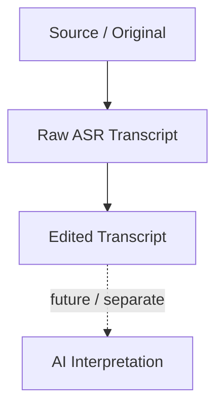
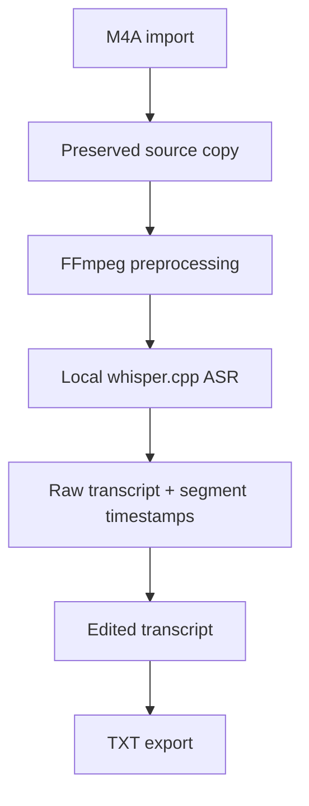
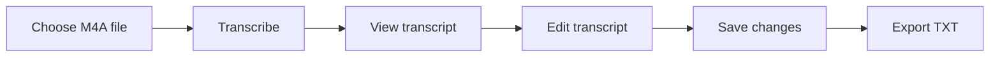
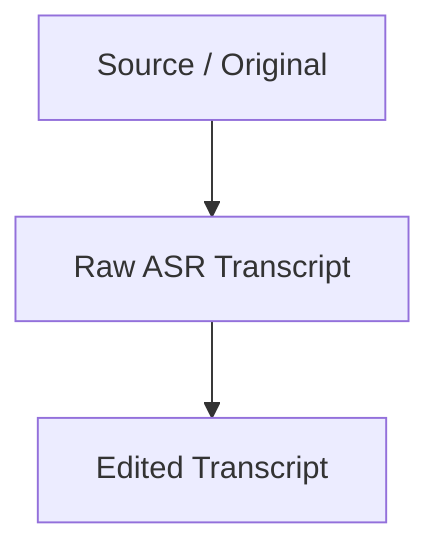
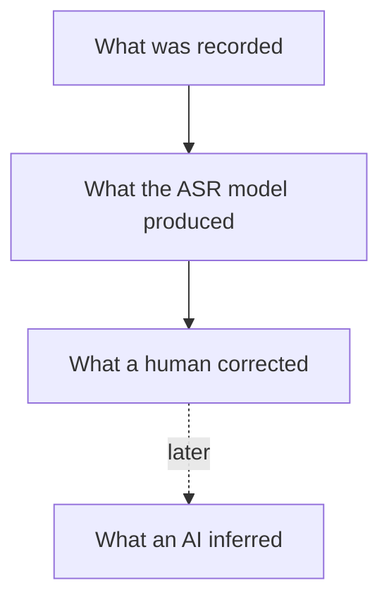
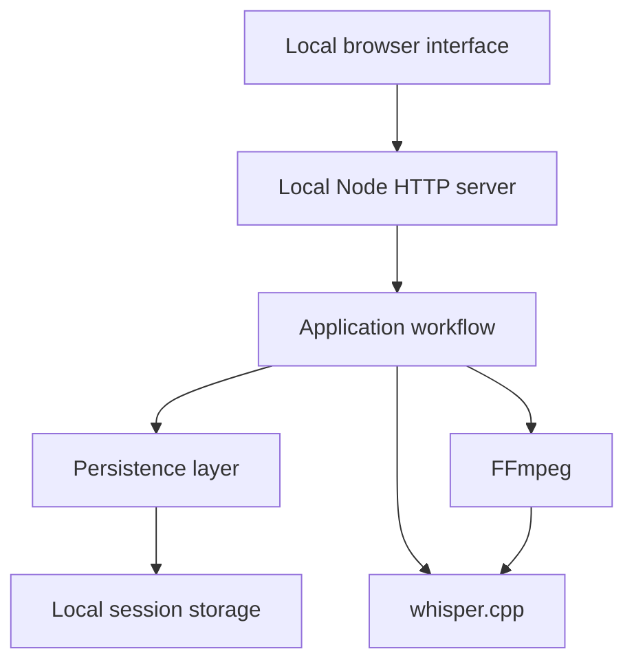
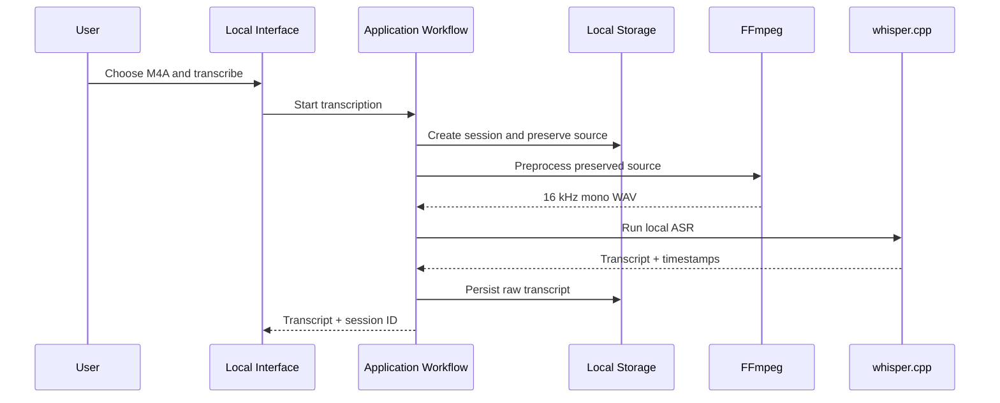
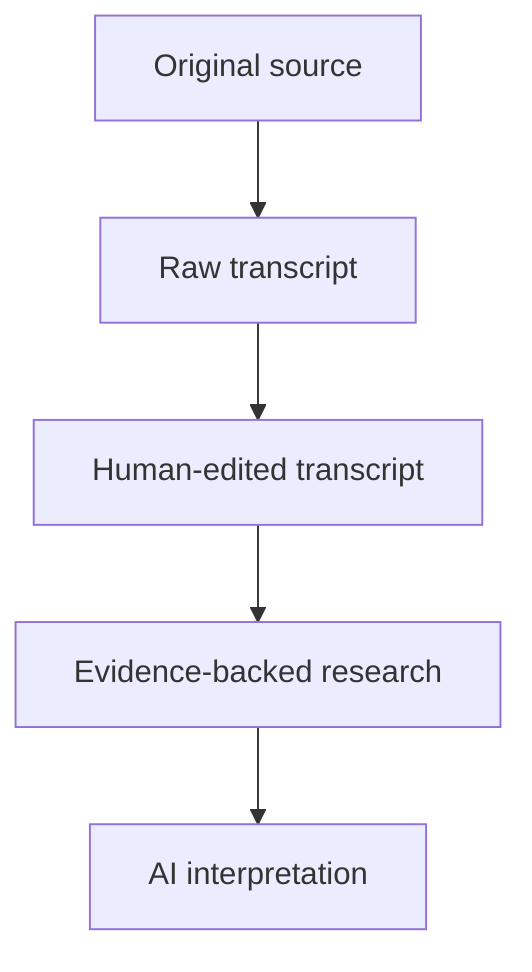

# Evidence Transcriber

A local-first, evidence-first transcription tool for lectures, meetings and recorded material.

Evidence Transcriber is built around a simple principle:

> Preserve what was actually said before changing, correcting or interpreting it.

The project keeps the original source, raw ASR output and human-edited transcript as separate provenance layers.

---

## Core provenance model



The current Student Alpha implements the first three layers.

AI interpretation is intentionally not part of the current workflow.

---

## Why this project exists

Speech-to-text is easy to demonstrate.

Reliable handling of what happens **after** transcription is more interesting.

If a transcript is corrected, summarized or later analysed by AI, it becomes important to distinguish between:

- the original source material,
- what the ASR model actually produced,
- what a human later corrected,
- and what an AI may later infer or interpret.

Evidence Transcriber is designed around that separation.

The goal is not only to produce text.

The goal is to preserve the evidence chain behind the text.

---

## Current Student Alpha

The current verified workflow is:



The full workflow has been verified on a real Swedish M4A recording on the target Windows machine.

### Current verified capabilities

- M4A import
- local transcription
- Swedish ASR
- whisper.cpp
- Whisper medium model
- FFmpeg preprocessing
- segment timestamps
- persistent sessions
- preserved original source
- separate raw transcript
- separate edited transcript
- session reopen
- TXT export
- UTF-8 Swedish text
- provenance regression testing

---

## Minimal Student Alpha Interface

Evidence Transcriber now includes a minimal local browser interface.

The application is currently started locally with:

```bash
npm run app
```

and opened at:

```text
http://127.0.0.1:4317
```

The current interface supports:



The transcription itself remains local.

The browser interface communicates with a local Node server, which uses the same verified transcription and persistence engine as the CLI workflow.

The interface is intentionally minimal.

It is not yet a packaged Windows desktop application.

---

## What the interface can do

A user can currently:

1. choose a local M4A file,
2. start local transcription,
3. view the resulting transcript,
4. edit the transcript,
5. save those corrections separately from the raw ASR output,
6. export the edited transcript as a TXT file.

The actual Student Alpha workflow has been manually verified end to end through the browser interface.

---

## CLI workflow

The underlying workflow is also available through a minimal CLI.

### Transcribe

```bash
npm run transcribe -- "path\to\recording.m4a"
```

This creates a persistent session and returns its session ID.

### Prepare an edited transcript

```bash
npm run edit -- <session-id>
```

### Save the edited transcript

```bash
npm run save -- <session-id>
```

### Export TXT

```bash
npm run export -- <session-id> "output.txt"
```

The CLI remains useful as a development and verification interface even though the local browser interface is now the primary Student Alpha interaction path.

---

## Provenance and data integrity

A central design requirement is that human editing must not destroy the original ASR result.

A session currently keeps data approximately like this:

```text
local-sessions/
  <session-id>/
    session.json

    source/
      original-file.m4a

    raw-transcript.json

    edited-transcript.json

    work/
      preprocessed.wav
      whisper-output.json
```

The important distinction is:



These are related provenance layers, but they are not treated as interchangeable data.

The normal editing workflow does not overwrite the raw transcript.

---

## Verified provenance example

A real Swedish transcription produced the following raw ASR phrase:

```text
ser det andra inte sett
```

and:

```text
en riktning att gå emot
```

The transcript was then corrected in the local interface to:

```text
ser det andra inte har sett
```

and:

```text
en riktning att gå mot
```

After saving the edited transcript:

- `raw-transcript.json` still contained the original ASR output,
- `edited-transcript.json` contained the human corrections.

The transcript was then exported through the browser interface.

The exported TXT contained:

```text
ser det andra inte har sett
```

and:

```text
en riktning att gå mot
```

while the raw transcript still contained the original ASR wording.

This behaviour was verified against the actual persisted files.

---

## Quality Engineering

Evidence Transcriber is also a Quality Engineering project.

The goal is not merely to demonstrate that Whisper can generate text.

Critical behaviour is being identified, tested and verified explicitly.

Current checks include:

- source preservation
- source integrity
- raw transcript persistence
- raw overwrite rejection
- session reopen
- raw/edited transcript separation
- session ID mismatch rejection
- TXT export
- preservation of raw data during export
- Swedish UTF-8 handling
- TypeScript type checking
- persistence/provenance regression testing
- actual Windows runtime verification

Run the current regression test with:

```bash
npm test
```

Run TypeScript validation with:

```bash
npm run typecheck
```

---

## Why provenance matters for AI systems

A transcription system can easily blur several different kinds of information.

For example:



Those layers do not have the same evidentiary status.

Evidence Transcriber therefore treats provenance as a core application concern rather than something added after the transcription feature works.

This becomes increasingly important if future versions introduce summarization, fact checking, retrieval or other AI interpretation.

---

## A real Windows engineering problem

During development, the initially downloaded prebuilt whisper.cpp runtime failed on the target Windows machine.

The failure was investigated instead of bypassed.

### Problem

Windows Code Integrity / Smart App Control blocked unsigned Whisper runtime DLLs.

The failure was reproducible outside Evidence Transcriber itself.

### Investigation

Windows Code Integrity event data identified the unsigned Whisper runtime as the blocked component.

The operating-system security control was therefore not disabled.

### Decision

Keep Smart App Control enabled.

### Solution

whisper.cpp was built locally as a static Release binary using the installed Microsoft C++ toolchain.

The resulting executable no longer depended on the blocked Whisper / GGML runtime DLLs.

### Result

Local Whisper medium transcription succeeded without weakening Windows security.

This became an important engineering constraint for the Student Alpha runtime.

---

## Architecture

The current architecture is deliberately small.



The CLI and local browser interface use the same transcription workflow.

The interface was added **on top of the verified engine rather than replacing it**.

This reduces duplication and helps keep critical provenance behaviour understandable and testable.

---

## Transcription workflow

The reusable transcription workflow performs the core Student Alpha operation:



Human editing happens afterward and is stored separately from the raw ASR output.

---

## Technology

The current implementation includes:

- TypeScript
- Node.js
- HTML
- CSS
- browser JavaScript
- FFmpeg
- whisper.cpp
- Whisper medium
- local filesystem persistence
- local HTTP interface
- Windows-first runtime

No cloud ASR is required for the current Student Alpha workflow.

---

## Local-first

The current transcription pipeline runs on the local Windows machine.

The browser interface is also local:

```text
Browser
   ↓
127.0.0.1
   ↓
Local Node server
   ↓
Local FFmpeg + whisper.cpp
   ↓
Local session storage
```

The current Student Alpha does not require sending the recording to a cloud transcription service.

---

## Current limitations

Evidence Transcriber is still a Student Alpha.

Current limitations include:

- Windows-first
- verified full file workflow currently focused on M4A
- the local interface must currently be started with `npm run app`
- not yet packaged as a Windows desktop application
- no real-time transcription
- no speaker diarization
- no cloud transcription
- no AI summarization
- no RAG
- no Evidence Layer yet
- recording functionality has been technically explored but is not part of the current Student Alpha workflow
- broader failure and recovery hardening is still in progress
- startup and distribution are still development-oriented

These limitations are deliberate.

The current priority is a small, understandable and verifiable core rather than feature breadth.

---

## Roadmap

### Now — School Ready / Student Alpha

Current focus:

- verified local file workflow
- minimal local interface
- failure and recovery hardening
- startup/usability improvements

### Next

Potential next steps after the School Ready core is stable:

- additional file formats
- recording integration
- improved session handling
- Windows packaging / easier startup

### Future research — Evidence Layer

A possible future layer for linking transcript segments to:

- source-backed research,
- fact checking,
- relevant project knowledge,
- external evidence,
- and AI-assisted interpretation,

while preserving provenance and human review.

The core idea would remain the same:



Each layer should remain distinguishable from the others.

The Evidence Layer is not part of the current Student Alpha.

---

## Project principles

Evidence Transcriber currently follows four main engineering principles.

### Local-first

Core transcription should work locally on the user's machine.

### Evidence-first

Original source material and raw model output should remain distinguishable from later edits and interpretations.

### Human-in-control

Human corrections are stored explicitly as human-edited data rather than silently replacing model output.

### School Ready beats Cool

A small workflow that works reliably is more valuable than a large feature set that cannot be trusted.

---

## Project status

Current verified milestones:

- ✅ Local Swedish ASR feasibility
- ✅ Windows system-audio + microphone capture feasibility
- ✅ Persistent import → transcript → reopen
- ✅ Actual M4A → local ASR → persist → reopen
- ✅ Student Alpha file workflow v0
- ✅ Minimal Student Alpha Interface
- 🟡 School Ready failure & recovery hardening

---

## Selected engineering milestones

### Local ASR feasibility

Verified that local Swedish transcription was practical on the actual target Windows hardware using:

```text
M4A
 ↓
FFmpeg
 ↓
16 kHz mono WAV
 ↓
whisper.cpp
 ↓
Swedish transcript + segment timestamps
```

This reduced the initial risk that local CPU-based ASR would be impractical for the project.

### Persistence and provenance

Verified that:

- the imported source can be preserved in a persistent session,
- raw transcript data can be stored separately,
- a session can be reopened,
- raw data survives reopen unchanged,
- human edits can be stored separately,
- export can use the edited version.

### Local interface

Verified through the actual browser interface that a user can:

```text
select file
→ transcribe
→ edit
→ save
→ export
```

without using terminal commands during the workflow itself.

---

## What this project is not

Evidence Transcriber is not currently intended to be:

- a full commercial transcription suite,
- a cloud transcription service,
- a meeting bot,
- a real-time speech assistant,
- a generic AI chat interface,
- or a demonstration of as many AI features as possible.

The current engineering challenge is narrower:

> Can a local transcription application preserve the provenance of AI-generated text while still being practical enough to use?

That is the problem the Student Alpha is currently designed to explore.

---

## Portfolio context

Evidence Transcriber is being developed as both a useful study tool and a Quality Engineering portfolio project.

The project focuses on areas such as:

- AI-assisted systems
- provenance
- data integrity
- local inference
- Windows integration
- failure investigation
- regression protection
- risk-based verification
- human review of AI output
- separation between model output and human modification

The emphasis is not simply on using an AI model.

The emphasis is on making AI output **traceable, testable and safe to modify**.

---

## Current development status

**Student Alpha**

The core file workflow and minimal local interface are operational and verified.

Current engineering work is moving into:

> **School Ready Failure & Recovery**

The next focus is not feature expansion.

It is making the existing workflow more resilient when expected runtime failures occur.